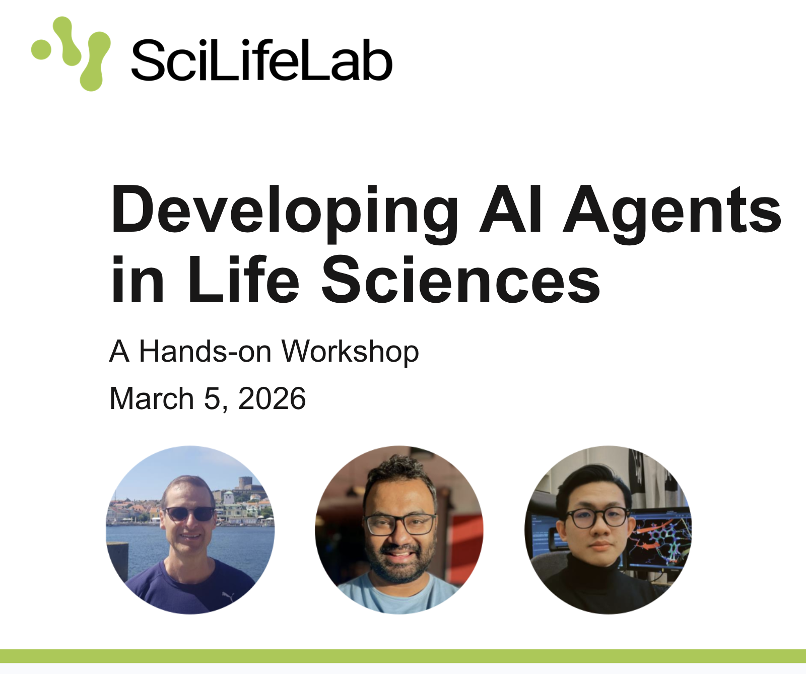

# [Developing AI Agents in Life Sciences](https://www.scilifelab.se/event/ai-agents-in-life-science-stockholm/)

> **SciLifeLab Data Centre** · Air & Fire, SciLifeLab, Solna · 2026-03-05

---

<div align="center">
<a href="https://www.scilifelab.se/event/ai-agents-in-life-science-stockholm/">

</a>
</div>

## Welcome

We are delighted to invite you to our hands-on workshop on **[Developing AI Agents in Life Sciences](https://www.scilifelab.se/event/ai-agents-in-life-science-stockholm/)**, organised by SciLifeLab Data Centre.

AI agents are emerging as autonomous systems that orchestrate scientific workflows by interacting with digital tools and data sources. In life science research, they can simplify complex analyses by automating data integration, run computational models, and coordinate experimental steps, making research pipelines more efficient and reproducible.

In this on-site workshop, we will introduce and discuss AI agents in life science, and engage in collaborative practical sessions.

Welcome!

---

## Event Details

| | |
|---|---|
| **Date** | Thursday, 5 March 2026 |
| **Time** | 10:00 – 15:30 *(coffee served from 09:30)* |
| **Location** | Room Air & Fire, SciLifeLab, Tomtebodavägen 23, Solna |
| **Format** | On-site only, no remote participation |
| **Catering** | Fika and lunch provided free of charge |

---

## Target Audience

This workshop is open to **researchers, PhD students, and research infrastructure staff** interested in hands-on experience with AI agents. Participants from any university affiliation, as well as industry researchers, are welcome.

**Prerequisites:**
- Basic Python programming skills
- Familiarity with Jupyter notebooks is helpful
- You must bring your own laptop

---

## Agenda

| Time | Session |
|---|---|
| 09:30 – 10:00 | Light breakfast and networking |
| 10:00 – 10:15 | **Presentation 1** — Introduction: Exploring how AI agents can transform life sciences · *Johan Alfredéen* |
| 10:15 – 10:30 | **Demonstration** — AI agents in action · *Mahbub Ul Alam* |
| 10:30 – 12:00 | **Hands-on Session 1** — Developing AI agents with LangGraph & ReAct · *Dinh Long Huynh, Mahbub Ul Alam* |
| 12:00 – 13:00 | Lunch and networking |
| 13:00 – 13:30 | **Continuation of Session 1** — LangGraph & ReAct |
| 13:30 – 15:00 | **Hands-on Session 2** — AI agent collaboration with the Model Context Protocol (MCP) · *Mahbub Ul Alam, Johan Alfredéen, Dinh Long Huynh* |
| 15:00 – 15:15 | **Presentation 2** — Deploying AI Agents: Legal, Technical, and Practical Considerations · *Johan Alfredéen* |
| 15:15 – 15:30 | Concluding session — Open Q&A |
| 15:30 | Fika and networking |

---

## Speakers & Facilitators

- **Johan Alfredéen (johan.alfredeen@scilifelab.uu.se)**: Data Engineer (AI), SciLifeLab Data Centre, 
- **Mahbub Ul Alam (mahbub.ul.alam@scilifelab.uu.se)**: Data Engineer (AI), SciLifeLab Data Centre, 
- **Dinh Long Huynh (dinh-long.huynh@uu.se)**: PhD Candidate, Uppsala University, 


---

## Workshop Sessions

| Session | Directory | Focus |
|---|---|---|
| **Session 1** | `Section_1_LangGraph/` | Build drug discovery AI agents using LangGraph and the ReAct pattern |
| **Session 2** | `session-2-mcp/` | Expose those tools over MCP and connect agents across servers |

Each session directory contains its own detailed `README.md` with full instructions, notebook guidance, and troubleshooting.

---

## Getting Started: Docker Setup

All workshop materials run inside Docker containers. **No local Python environment setup is required.**

> ⚠️ **Docker Desktop must be installed and running on your laptop.**  

---

### Step 1: Install Docker Desktop

Docker Desktop is the recommended way to run Docker on your personal machine. It includes everything you need: the Docker engine, CLI, and a graphical interface.

#### 🍎 macOS

1. Go to [https://docs.docker.com/desktop/install/mac-install/](https://docs.docker.com/desktop/install/mac-install/)
2. Choose the installer for your chip:
   - **Apple Silicon (M1/M2/M3/M4)** → download the `Apple Silicon` `.dmg`
   - **Intel** → download the `Intel Chip` `.dmg`
3. Open the downloaded `.dmg` file and drag **Docker** into your Applications folder
4. Launch Docker from Applications and follow the onboarding prompts
5. Verify the installation by opening a terminal and running:
   ```bash
   docker --version
   ```

#### 🐧 Linux

Docker Desktop is available for Ubuntu, Debian, and Fedora.

1. Go to [https://docs.docker.com/desktop/install/linux-install/](https://docs.docker.com/desktop/install/linux-install/) and select your distribution
2. Follow the distribution-specific instructions (typically adding the Docker apt/rpm repository and installing the package)
3. After installation, start Docker Desktop from your application launcher
4. Verify:
   ```bash
   docker --version
   ```

> Alternatively, you can install **Docker Engine** directly (without the Desktop GUI) by following [https://docs.docker.com/engine/install/](https://docs.docker.com/engine/install/). This is sufficient for running workshop containers.

#### 🪟 Windows

1. Go to [https://docs.docker.com/desktop/install/windows-install/](https://docs.docker.com/desktop/install/windows-install/)
2. Download the **Docker Desktop Installer**
3. Run the installer — when prompted, ensure **"Use WSL 2 instead of Hyper-V"** is selected (recommended)
4. After installation, Docker Desktop will start automatically
5. Open **PowerShell** or **Command Prompt** and verify:
   ```cmd
   docker --version
   ```

> **WSL 2 note:** Docker on Windows works best with WSL 2 (Windows Subsystem for Linux 2). If it is not already enabled, Docker Desktop will guide you through enabling it during setup. More information at [https://learn.microsoft.com/en-us/windows/wsl/install](https://learn.microsoft.com/en-us/windows/wsl/install).

---

### Step 2: Save Your API Key (on the day of the workshop)

On the morning of the workshop, you will receive an **OpenAI API key by email**. You will need this key for both sessions.

> 🔑 **Do not share this key with others or commit it to any public repository.**

---

### Step 3: Pull and Run the Workshop Images

We strongly recommend pulling the pre-built images from Docker Hub. This is the fastest way to get started and is the only setup we will support during the workshop.

#### Session 1: LangGraph Agent Development

**Pull the image:**
```bash
docker pull long2406/scilifelab_langgraph:v1
```

**Run the container:**
```bash
docker run -p 8888:8888 -e OPENAI_API_KEY="sk-..." long2406/scilifelab_langgraph:v1
```

Then open **http://localhost:8888** in your browser and navigate to `langgraph_lab.ipynb`.

---

#### Session 2: MCP Agent Collaboration

**Pull the image:**
```bash
docker pull mahbub1969/scilifelab-mcp-workshop:v1
```

**Run the container** (replace `sk-...` with your OpenAI API key):
```bash
docker run -p 7860:7860 -e OPENAI_API_KEY="sk-..." mahbub1969/scilifelab-mcp-workshop:v1
```

Then open **http://localhost:7860** in your browser and navigate to `1-mcp-from-scratch/mcp_workshop.ipynb`.

---

### Step 3 (Optional, not recommended): Build the Images Locally

If you prefer to build the images yourself from the provided `Dockerfile`s, you can do so as follows.

> ⚠️ **Building locally is not recommended for the workshop.** Build times can be significant and we cannot troubleshoot build issues during the session. Use the pre-built images above unless you have a specific reason to build locally.

**Session 1:**
```bash
cd Section_1_LangGraph/
docker build -t scilifelab-langgraph-jupyter .
docker run --rm -it -p 8888:8888 scilifelab-langgraph-jupyter
```

**Session 2:**
```bash
cd session-2-mcp/
docker build -t scilifelab-mcp-workshop:v1 .
docker run -p 7860:7860 -e OPENAI_API_KEY="sk-..." scilifelab-mcp-workshop:v1
```

---

## Repository Structure

```
/
├── README.md                        ← You are here
│
├── Section_1_LangGraph/             ← Session 1: LangGraph & ReAct agents
│   ├── README.md                    ← Full instructions for Session 1
│   ├── Dockerfile
│   ├── langgraph_lab.ipynb          ← Workshop notebook (exercises)
│   ├── langgraph_answer.ipynb       ← Reference solutions
│   └── ...
│
└── session-2-mcp/                   ← Session 2: MCP agent collaboration
    ├── README.md                    ← Full instructions for Session 2
    ├── Dockerfile
    ├── 1-mcp-from-scratch/          ← Main session notebook
    ├── 2-bonus-mcp-sdk-implementation/   ← Bonus: MCP Python SDK
    └── 3-bonus-mcp-serve-app-integration/ ← Bonus: SciLifeLab Serve + MCP
```

For detailed content, notebook guidance, and troubleshooting, please refer to the `README.md` inside each session directory.

---

## Questions

For questions about the workshop content or the SciLifeLab Serve platform, contact the SciLifeLab Data Centre team at **serve@scilifelab.se**.