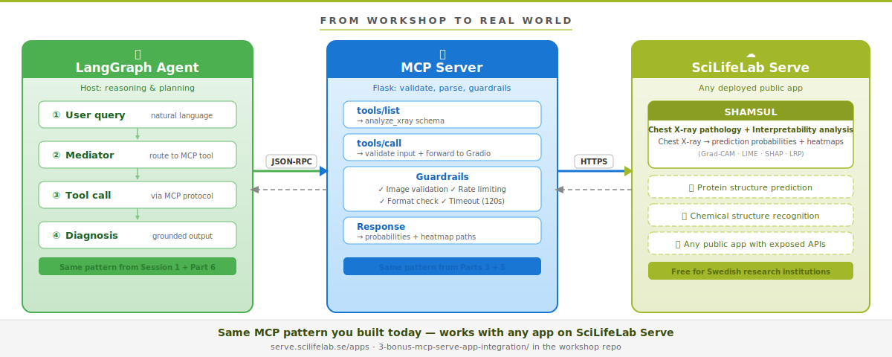

# Bonus: Wrapping a SciLifeLab Serve Gradio App as an MCP Server

## From Workshop to Real-World: Connecting a Deployed Medical AI Model via MCP

---

## What This Is



In `1-mcp-from-scratch` you built an MCP server from scratch, added guardrails, and connected your LangGraph agent to it. The tools you exposed (`get_drug_info`, `resolve_smiles`, `get_properties`, `lit_search`) were all backed by local data or simple API calls.

But what about **deployed machine learning models**, the kind that run on servers, accept images as input, and return complex structured predictions?

This bonus section bridges that gap. You will wrap [SHAMSUL](https://shamsul.serve.scilifelab.se/), a chest X-ray prediction model hosted on SciLifeLab Serve, as an MCP server. Any MCP-compatible agent can then discover and call it, exactly like the drug discovery tools you built in the main session.

**SHAMSUL** (Systematic Holistic Analysis to investigate Medical Significance Utilizing Local interpretability methods) analyses chest X-ray images using a deep learning model and returns:

- Prediction probability scores for multiple pathologies
- Visualisation heatmaps (Grad-CAM, LIME, SHAP, LRP) showing which regions of the image influenced each prediction

> **Reference:** M. U. Alam et al., "SHAMSUL: Systematic Holistic Analysis to investigate Medical Significance Utilizing Local interpretability methods in deep learning for chest radiography pathology prediction," *Nordic Machine Intelligence*, vol. 3, pp. 27–47, 2023. [doi:10.5617/nmi.10471](https://doi.org/10.5617/nmi.10471)

---

## How It Connects to Session 2

| Session 2 concept | How it appears here |
|---|---|
| MCP Server (Part 3) | `shamsul-mcp-server.py` exposes `analyze_xray` as an MCP tool |
| MCP Client (Part 3) | `shamsul-mcp-client.py` discovers and calls the tool |
| Input validation (Part 5.2) | Server validates image path and study ID before calling Gradio |
| Tool descriptions (Part 2.3) | Carefully written to guide the LLM without misleading it |
| LangGraph + MCP (Part 6) | `agent-mediator.py` — a LangGraph agent that routes X-rays to the specialised tool and synthesises a diagnosis |
| MCP Python SDK (Part 7) | Both server and client use the official `mcp` SDK with FastMCP |

---

## Directory Structure

```
3-bonus-serve-app-integration/
├── README.md                    ← This file
├── shamsul-mcp-server.py        ← MCP server wrapping the SHAMSUL Gradio app
├── shamsul-mcp-client.py        ← Standalone client to test the server
├── agent-mediator.py            ← LangGraph agent using the MCP tool
├── example.jpg                  ← Example chest X-ray image
└── architecture-diagram.svg     ← Architecture diagram
```

---

## Prerequisites

You need the Session 2 virtual environment, plus:

- An **OpenAI API key** (same as `1-mcp-from-scratch/`) set as `OPENAI_API_KEY` in your `.env` or environment
- A **sample chest X-ray image** in JPEG format from the CheXpert dataset referenced in the SHAMSUL paper

---

## Quick Start

### Step 1: Run the MCP server

```bash
python shamsul-mcp-server.py
```

The server starts on `http://localhost:8503/mcp` (same Flask + JSON-RPC pattern as Session 2, but using the SDK internally for Gradio communication).

### Step 2: Test with the standalone client

In a second terminal:

```bash
python shamsul-mcp-client.py --image example.jpg --study-id "CheXpert-v1.0/valid/patient64664/study1/view1_frontal.jpg"
```

### Step 3: Run the LangGraph agent

```bash
python agent-mediator.py --image example.jpg --study-id "CheXpert-v1.0/valid/patient64664/study1/view1_frontal.jpg"
```

The agent receives a natural-language query, routes the image to the MCP tool, retrieves objective probability data, and generates a grounded diagnosis.

---

## File Descriptions

### `shamsul-mcp-server.py`

A Flask-based MCP server that wraps the SHAMSUL Gradio app, exposing one tool:

| Tool | Description | Input | Output |
|---|---|---|---|
| `analyze_xray` | Analyse a chest X-ray for thoracic pathologies using the SHAMSUL model | `image_path` (string), `study_id` (string) | JSON with pathology probabilities and local paths to segmentation overlay images |

**What happens inside:** the server receives an MCP `tools/call` request, validates the image path, uses `gradio_client` to send the image to `https://shamsul.serve.scilifelab.se/`, parses the response (gallery images + probability table), copies segmentation overlays to a local output directory, and returns structured JSON via the standard MCP response format.

**Guardrails** (matching Part 5.2): image path validation (file must exist, must be `.jpg`, `.jpeg`, or `.png`, must be under 20 MB), rate limiting (max 50 calls before server restart), and a 120-second timeout on the Gradio call.

### `shamsul-mcp-client.py`

A minimal MCP client (same `MCPClient` pattern from Session 2) that initialises the MCP handshake, lists available tools, calls `analyze_xray` with the provided image, and prints probabilities and saves segmentation images locally.

### `agent-mediator.py`

A LangGraph agent demonstrating the **"tool-first" pattern**: the LLM does not attempt to interpret the X-ray itself. Instead it follows three steps — a **mediator node** receives the user query and decides to call `analyze_xray`, a **tool execution node** sends the image to the MCP server and retrieves objective data, and a **diagnosis node** injects the probability data into a structured prompt and asks the LLM to synthesise a diagnosis grounded only in the tool's output.

This is the same `StateGraph` → `add_node` → `add_edge` → `compile` pattern from LangGraph in Session 1, now connected to MCP as you learned in Session 2 Part 6.

---

## Architecture


---

## Key Differences from Session 2

| Aspect | Session 2 main notebook | This bonus |
|---|---|---|
| Tool input | Text (drug IDs, SMILES strings) | Images (chest X-rays) |
| Backend | Local JSON database + optional RDKit | Remote ML model on SciLifeLab Serve |
| Transport to backend | Direct Python dict lookup | `gradio_client` over HTTPS |
| Output | Text (drug info, properties) | Structured data + image files (heatmaps) |
| Agent pattern | Single tool call | Multi-step: route → analyse → diagnose |

---

## Troubleshooting

**`gradio_client` connection timeout:** The SHAMSUL server runs on shared infrastructure.The request may take 30–60 seconds.

**`FileNotFoundError` on segmentation images:** The Gradio client downloads images to a temporary directory. If the path does not exist, check that your `gradio_client` version is ≥ 1.0.0.

**Agent does not call the tool:** Make sure `shamsul_mcp_server.py` is running on port 8503 before starting `agent_mediator.py`.

---

## Further Exploration

- Try different X-ray images and compare probability outputs
- Add a second MCP tool (e.g. `get_drug_info` from Session 2) and ask the agent to cross-reference a diagnosis with drug treatment options
- Connect both `advanced_server.py` (port 8502) and `shamsul-mcp-server.py` (port 8503) to a single LangGraph agent using `MultiServerMCPClient` — a true multi-server MCP ecosystem

---

## Reflection: From Paper to Protocol

Think about how life science research typically flows. A team explores a problem, trains a model or builds an analysis pipeline, publishes results in a paper, maybe releases code on GitHub, and then the work stops there. The artefact sits in a repository. Another researcher who wants to build on it faces the same steep climb: reading the paper, understanding the code, reproducing the environment, figuring out the input format, interpreting the output. Each reuse is essentially starting from scratch.

**SciLifeLab Serve** already shortens this path. By deploying a research tool as a live application, whether it is a deep learning model, a visualisation dashboard, an interactive database, or an analysis pipeline, Serve turns a static research output into a running service that anyone can use without reproducing the original environment. And this is not limited to machine learning or healthcare. Today, Serve hosts **147+ public applications** spanning genomics, proteomics, metabolomics, spatial biology, ecology, plant science, drug discovery, clinical research, education, and more (see the table below).

**MCP takes this one step further.** By wrapping a Serve app as an MCP server, any deployed tool, not just a trained model, becomes *discoverable, self-describing, and callable by any MCP-compatible agent*. An LLM doesn't need to know how SHAMSUL was trained, how a Shiny proteomics dashboard was built, or what database backs a knowledge graph explorer. It only needs to read the tool description, understand the inputs, and interpret the outputs. What you built in this bonus section is exactly that bridge.

**But why does the LLM matter here? Isn't this just connecting APIs?** Not quite. You could wire APIs together with a script, and life science researchers have been doing that for years with workflow managers and pipeline tools. The LLM adds something qualitatively different. It acts as a **reasoning layer** that can interpret a life science researcher's natural-language question ("Does this X-ray suggest anything that contraindicates metformin?"), break it into the right sequence of tool calls (analyse the image, look up the flagged pathology, check drug interactions), and then **synthesise the results into a coherent answer** that no single tool could produce on its own. A traditional pipeline requires you to know in advance which tools to call and in what order. An LLM agent can figure that out from the question. This lowers the barrier dramatically: a domain expert who has never written an API call can describe what they need in plain language and get a composed, grounded answer. It also means the same set of MCP tools can serve very different questions without anyone rewiring the pipeline.

Now consider what this enables:

- **Faster proof of concept.** A researcher with a new hypothesis can wire together existing deployed tools, a chest X-ray classifier, a drug interaction database, a proteomics analysis pipeline, a literature search engine, into a working workflow in an afternoon, without rewriting any of the underlying code.
- **New workflows from existing pieces.** The same `analyze_xray` tool you used here could be combined with a drug toxicity predictor like DILI Predictor, a knowledge graph like the Chemical Biology Atlas, or a spatial transcriptomics viewer like TissUUmaps — each one an independent MCP server, composed into something none of them could do alone.
- **Crossing domain boundaries.** An ecologist studying plankton populations (IFCB Plankton Classifier) could connect their image classifier to an environmental exposomics dashboard. A pharmacologist could chain a binding affinity predictor (DTA-GNN) with a pharmacokinetics simulator (PKPD SiAn) and a cardiotoxicity model (DICTrank). The standard interface makes these connections possible without either team needing to understand the other's codebase.
- **Shareability.** An MCP server is a standard interface. A workflow you build can be shared with a colleague who plugs it into their own agent, swaps one tool for another, or adds a step you hadn't considered.
- **Reproducibility by design.** Instead of "download our code and hope it runs," the promise becomes "connect to our server and call the tool." The environment, dependencies, and model weights are the provider's responsibility, not the consumer's.

The pattern you have learned today, deploy a research tool on Serve, wrap it as an MCP server, connect it to an LLM agent, is a repeatable recipe. It works for a deep learning model, a Shiny visualisation app, a REST API, a Streamlit exploration tool, or a Dash dashboard. Every research application that sits deployed but underused is a candidate. The possibilities for connecting, composing, and building on each other's work are wide open.

---

## What's Already on SciLifeLab Serve

To give you a sense of the scale and diversity, here is a categorised snapshot of the **147+ public applications** currently hosted on [serve.scilifelab.se/apps](https://serve.scilifelab.se/apps/). Each of these could potentially be wrapped as an MCP server using the pattern you learned today.

| Category | Example Apps | What They Do |
|---|---|---|
| **Drug Discovery & Cheminformatics** | Repuragent, DTA-GNN, DILI Predictor, DICTrank, PKSmart, Chemical Biology Atlas, Ames Mutagenicity, cpLogD | Binding affinity prediction, toxicity assessment, drug repurposing, knowledge graphs, QSAR/QSPR modelling |
| **Proteomics** | NormalyzerDE, HDAnalyzeR, OlinkWrapper, PeptAffinity, ThermoTargetMiner, KISSE | Protein expression analysis, normalisation, differential expression, drug-target discovery, species identification |
| **Genomics & Transcriptomics** | starbase, 5PSeq Explorer, shinyWGCNA, RNA-Seq Power, Fusions4U, POPUL-R, MethylR | Transposable element exploration, co-expression analysis, gene fusion databases, power analysis, methylation pipelines |
| **Spatial Biology & Imaging** | TissUUmaps, Points2Regions, HDCA Brain Viewer, SNRApp | Spatial transcriptomics visualisation, tissue mapping, signal-to-noise analysis for spatial omics |
| **Metabolomics & Exposomics** | Librarian, S3WP Exposomics, peaktest, thoreylipid | MS² spectral library building, longitudinal exposomics, metabolite atlas, lipidomics |
| **Clinical & Public Health** | SHAMSUL, msp-tracker, COVID-19 Dashboard, ADHD Medication, child-BMI, MI Prediction | Chest X-ray analysis, MS progression tracking, epidemiological dashboards, clinical prediction models |
| **Ecology & Environment** | IFCB Plankton Classifier, TRIDENT, Natural Nations, Multifunctionality Assessment | Plankton image classification, ecotoxicity prediction, citizen science, urban infrastructure assessment |
| **Plant Biology & Biomechanics** | HookMotion, TurgoLab, Anatomeshr | Plant growth kinematics, FEM-based tissue simulation, anatomical mesh generation |
| **Metagenomics & Parasitology** | BAGS, Metagenomics Coverage Calculator, Plasmogem, malaria CRISPR | Gene catalogues, sequencing depth estimation, parasite genetic tools, CRISPR screen visualisation |
| **Knowledge Graphs & Databases** | KG Dashboard, AMR-KG, SPECS-MCP-SERVER, BridgeDb | Drug repurposing KGs, antimicrobial resistance, chemical compound databases, cross-database identifier mapping |
| **Education & Teaching** | PKPD SiAn, Demo of Bayesian Updating, Demo of ROC Curves, Demo of XGBoost | Interactive teaching tools for pharmacokinetics, statistical concepts, and machine learning |
| **Data Exploration & General Tools** | DataScanR, TriplotGUI, nDrop2exel, gsalit | General-purpose data cleaning, molecular epidemiology, file conversion, genotyping pipelines |

App frameworks on Serve include **Gradio, Shiny, Streamlit, Dash, TissUUmaps, all deployable and all wrappable as MCP servers.